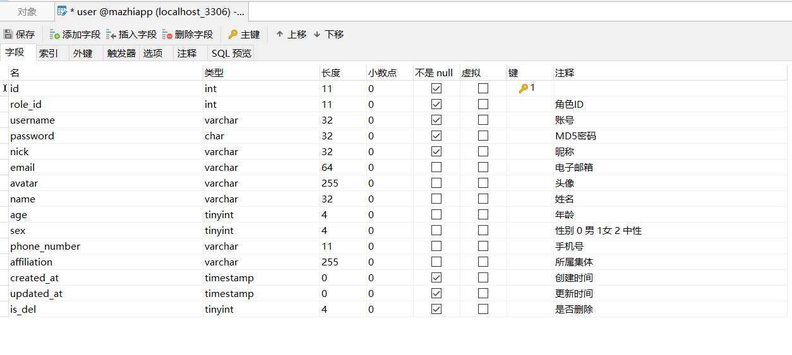
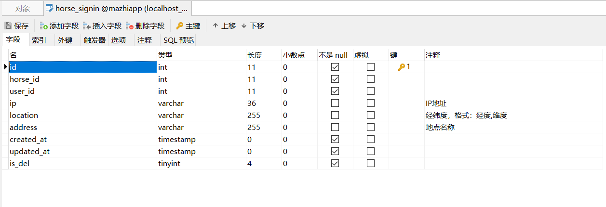
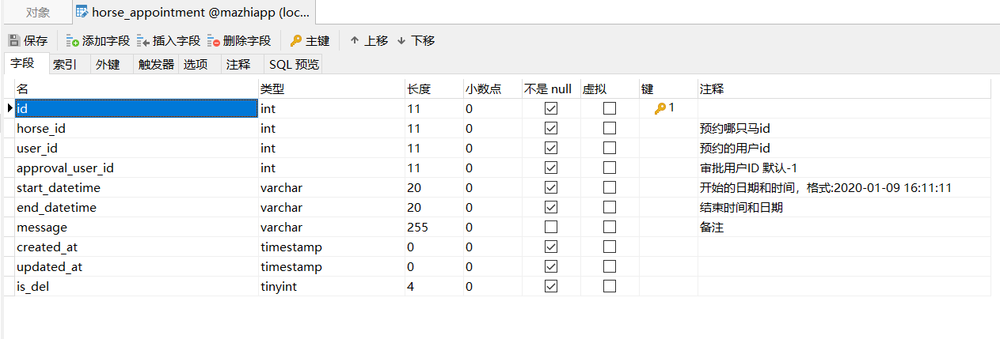

# 后端开发文档

## 架构设计


## 角色设计

### 超级管理员

### 普通管理员

### 负责人

### 普通用户

### 匿名用户

## 数据库设计

### 用户表



### 角色表


### 角色路由权限表


### 角色申请表


### 马匹表


### 负责人签到表



### 马的负责申请表


### 马的汇报表


### 马的预约表



### 消息表


### 日志表


## API设计

### 说明

- 所有返回数组类型的数据，都应该需要有分页
- 所有api前都应该加上`/api/v1`路由
- 命名使用小驼峰命名

### 分页

请求

```js
{
    pageNum:1, // number 页码
    pageSize:10, // number 每页条数
    ...
}
```

响应

```js
{
    pageNum:1, // number 页码
    pageSize:10, // number 页大小
    pageTotal:50, // number 总页数
}
```


### 用户登录

POST /login

允许角色：匿名用户

请求：

```js
{
    username:'root', // string 用户名
    password:'1234', // string 密码
    code:'yxaw', // string 验证码
}
```

响应：

```js
{
    errcode:0, 
    message:'登录成功',
    data:{
        ...
    }
}
```


